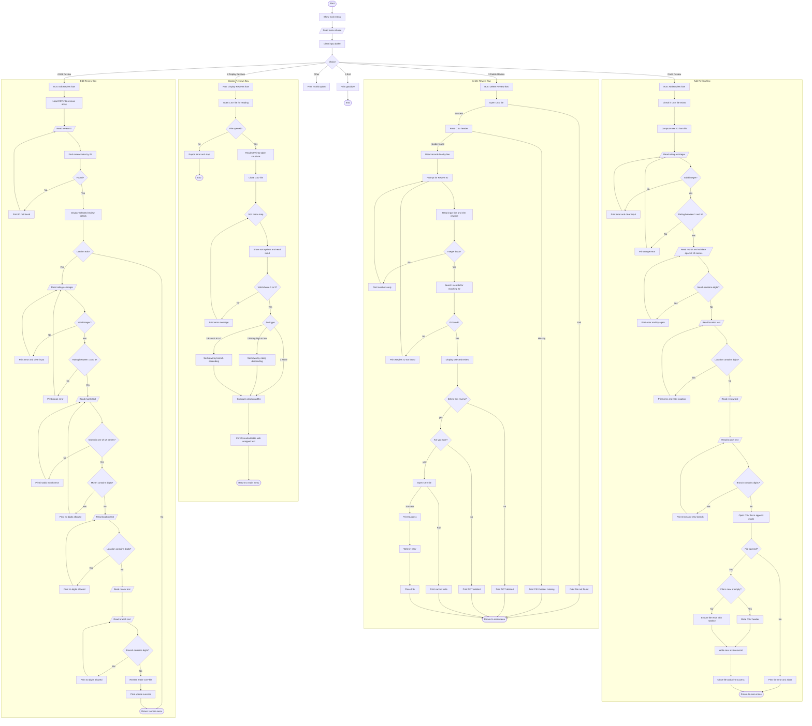

```mermaid
flowchart TD
%% ===== Main menu branch (kept as-is) =====
A([Start]) --> B[Show main menu]
B --> C[/Read menu choice/]
C --> D[Clear input buffer]
D --> E{Choice}
E -->|1 Display Reviews| F1[Run: Display Reviews flow]
E -->|2 Add Review| F2[Run: Add Review flow]
E -->|3 Delete Review| F3[Run: Delete Review flow]
E -->|4 Edit Review| F4[Run: Edit Review flow]
E -->|5 Exit| G[Print goodbye] --> H([End])
E -->|Other| X[Print invalid option]

%% ===== Subflows (unchanged logic; only IDs prefixed so they can coexist) =====
subgraph DISPLAY_REVIEWS["Display Reviews flow"]
F1 --> DR_B[Open CSV file for reading]
DR_B --> DR_C{File opened?}
DR_C -->|No| DR_Z[Report error and stop] --> DR_END([End])
DR_C -->|Yes| DR_D[Read CSV into table structure]
DR_D --> DR_E[Close CSV file]
DR_E --> DR_F{Sort menu loop}
DR_F --> DR_G[Show sort options and read input]
DR_G --> DR_H{Valid choice 1 to 3?}
DR_H -->|No| DR_I[Print error message] --> DR_F
DR_H -->|Yes| DR_J{Sort type}
DR_J -->|1 None| DR_K[Compute column widths]
DR_J -->|2 Rating high to low| DR_L[Sort rows by rating descending] --> DR_K
DR_J -->|3 Branch A to Z| DR_M[Sort rows by branch ascending] --> DR_K
DR_K --> DR_N[Print formatted table with wrapped text]
DR_N --> DR_R([Return to main menu])
end

subgraph ADD_REVIEW["Add Review flow"]
F2 --> AR_B[Check if CSV file exists]
AR_B --> AR_C[Compute next ID from file]
AR_C --> AR_E[/Read rating as integer/]
AR_E --> AR_F{Valid integer?}
AR_F -->|No| AR_G[Print error and clear input] --> AR_E
AR_F -->|Yes| AR_H{Rating between 1 and 5?}
AR_H -->|No| AR_I[Print range error] --> AR_E
AR_H -->|Yes| AR_J[/Read month and validate against 12 names/]
AR_J --> AR_K{Month contains digits?}
AR_K -->|Yes| AR_K1[Print error and try again] --> AR_J
AR_K -->|No| AR_M[/Read location text/]
AR_M --> AR_N{Location contains digits?}
AR_N -->|Yes| AR_O[Print error and retry location] --> AR_M
AR_N -->|No| AR_P[/Read review text/]
AR_P --> AR_S[/Read branch text/]
AR_S --> AR_T{Branch contains digits?}
AR_T -->|Yes| AR_U[Print error and retry branch] --> AR_S
AR_T -->|No| AR_V[Open CSV file in append mode]
AR_V --> AR_W{File opened?}
AR_W -->|No| AR_W1[Print file error and abort] --> AR_R
AR_W -->|Yes| AR_X{File is new or empty?}
AR_X -->|Yes| AR_Y[Write CSV header]
AR_X -->|No| AR_AA[Ensure file ends with newline]
AR_Y --> AR_AB[Write new review record]
AR_AA --> AR_AB
AR_AB --> AR_AC[Close file and print success]
AR_AC --> AR_R([Return to main menu])
end

subgraph DELETE_REVIEW["Delete Review flow"]
F3 --> DEL_B[Open CSV file]
DEL_B -->|Fail| DEL_B1[Print File not found] --> DEL_Z([End])
DEL_B -->|Success| DEL_C[Read CSV header]
DEL_C -->|Missing| DEL_C1[Print CSV header missing] --> DEL_Z
DEL_C -->|Header found| DEL_D[Read records line by line]
DEL_D --> DEL_E[Prompt for Review ID]
DEL_E --> DEL_F[Read input line and trim newline]
DEL_F --> DEL_G{Integer input?}
DEL_G -->|No| DEL_E1[Print numbers only] --> DEL_E
DEL_G -->|Yes| DEL_H[Search records for matching ID]
DEL_H --> DEL_I{ID found?}
DEL_I -->|No| DEL_E2[Print Review ID not found] --> DEL_E
DEL_I -->|Yes| DEL_J[Display selected review]
DEL_J --> DEL_K{Delete this review?}
DEL_K -->|no| DEL_K1[Print NOT deleted] --> DEL_Z
DEL_K -->|yes| DEL_L{Are you sure?}
DEL_L -->|no| L1[Print NOT deleted] --> DEL_Z
DEL_L -->|yes| DEL_M[Open CSV file ]
DEL_M -->|Fail| DEL_M1[Print cannot write] --> DEL_Z
DEL_M -->|Success| DEL_N[Print Success]
DEL_N --> DEL_O[Write in CSV]
DEL_O --> DEL_P[Close File]
DEL_P --> DEL_Z([Return to main menu])
end

subgraph EDIT_REVIEW["Edit Review flow"]
F4 --> ER_B[Load CSV into reviews array]
ER_B --> ER_C[/Read review ID/]
ER_C --> ER_D[Find review index by ID]
ER_D --> ER_E{Found?}

ER_E -->|No| ER_F[Print ID not found] --> ER_C
ER_E -->|Yes| ER_G[Display selected review details]

ER_G --> ER_H{Confirm edit?}
ER_H -->|No| ER_R

%% ===== Rating validation loop =====
ER_H -->|Yes| ER_R2[/Read rating as integer/]
ER_R2 --> ER_R3{Valid integer?}
ER_R3 -->|No| ER_R4[Print error and clear input] --> ER_R2
ER_R3 -->|Yes| ER_R5{Rating between 1 and 5?}
ER_R5 -->|No| ER_R6[Print range error] --> ER_R2
ER_R5 -->|Yes| ER_M2[/Read month text/]

%% ===== Month validation loop =====
ER_M2 --> ER_M3{Month is one of 12 names?}
ER_M3 -->|No| ER_M4[Print invalid month error] --> ER_M2
ER_M3 -->|Yes| ER_M5{Month contains digits?}
ER_M5 -->|Yes| ER_M6[Print no digits allowed] --> ER_M2
ER_M5 -->|No| ER_L2[/Read location text/]

%% ===== Location validation loop =====
ER_L2 --> ER_L3{Location contains digits?}
ER_L3 -->|Yes| ER_L4[Print no digits allowed] --> ER_L2
ER_L3 -->|No| ER_T1[/Read review text/]

%% ===== Review text (no digit rule requested) =====
ER_T1 --> ER_B2[/Read branch text/]

%% ===== Branch validation loop ====
ER_B2 --> ER_B3{Branch contains digits?}
ER_B3 -->|Yes| ER_B4[Print no digits allowed] --> ER_B2
ER_B3 -->|No| ER_N[Rewrite entire CSV file]

ER_N --> ER_O[Print update success]
ER_O --> ER_R([Return to main menu])
end
```